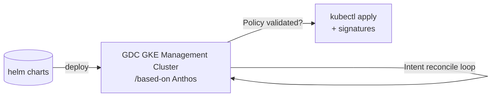

Main blog - https://github.com/ObrienlabsDev/blog

# Secure Private Data Center
Consolidated sovereign private data center artifacts.
This repo details various approaches to standing up an air gapped data center that optionally uses or replicates functionality in GDC (Google Distributed Cloud) - software only, connected, air gapped and air gapped appliance (formerly edge) solutions.


# Hardware
See https://cloud.google.com/sovereign-cloud?hl=en which includes Google Cloud Dedicated and Google Distributed Cloud
Only Intel processors are supported by GDC as of mid 2026 - x86-64 CPUs at microarchitecture level v3 (x86-64-v3) or higher.  This excludes all ARM based machines including M series and the GB10 from NVidia in the DGX Spark. https://docs.cloud.google.com/kubernetes-engine/distributed-cloud/bare-metal/docs/installing/minimal-infrastructure


## GDC - Google Distributed Cloud
- https://github.com/ObrienlabsDev/blog/issues?q=state%3Aopen%20label%3A%22GDC%22
- https://cloud.google.com/gov/federal-defense-and-intel
- 
GDC is Google's version of private or hybrid cloud within your own data center. 
There are 3 main versions of GDC - where GDC Connected and GDC air-gapped are Google provided hardware and software.  We will concentrate on [GDC software only - for bare metal](https://docs.cloud.google.com/kubernetes-engine/distributed-cloud/bare-metal/docs/concepts/about-bare-metal) formerly branded as "Anthos clusters on-prem or bare metal" - see the older 2022 GCP services list referencing Anthos - https://cloud.google.com/terms/services/index-20220713

[GDCC](https://docs.cloud.google.com/distributed-cloud/edge/latest/docs/overview) - Google Distributed Cloud connected (edge)

[GDCAG](https://docs.cloud.google.com/distributed-cloud/hosted/docs/ga/gdch) - Google Distributed Cloud air-gapped

[GDGAGA](https://docs.cloud.google.com/distributed-cloud/hosted/docs/latest/appliance/admin/connect-the-device) - Google Distributed Cloud air-gapped Appliance

[GDCSO](https://docs.cloud.google.com/distributed-cloud/docs/overview#gdcv) - Google Distributed Cloud software only - [Bare Metal](https://docs.cloud.google.com/kubernetes-engine/distributed-cloud/bare-metal/docs/concepts/about-bare-metal)

[GDCS](https://docs.cloud.google.com/distributed-cloud/sandbox/latest) - Google Distributed Cloud Sandbox

There was a historical variant of GDC Hosted (renamed GDC connected (edge) where a POC can be setup to install GDC software only on your own VMs to prep for eventual delivery and integration of the 4 minimum racks in a 300k/month GDC Hosted - https://docs.cloud.google.com/distributed-cloud/hosted/docs/latest/gdch/resources/faq

### GDC Requirements
### GDC Air Gapped Requirements

Operational responsibities include instance installation, operation, infrastructure management, L1/L2 support, SLDC.
All personnel involved with the GDC Air gapped instance must be local - and not remotely accessible by an external client, partner or google team.
The differentiation between Google Distributed Cloud air-gapped and GDC connected - is the operational and SRE aspect - GDC-AG is locally operated and under local SRE.

Therefore, all the operational responsibilities, including facilitating, operating the instances, managing the infrastructure, L1/L2 support cycle, and software lifecycle, need to be done by the Operator.
#### Cgroupsv2
In ubuntu 22.04+

#### HSM
#### PKI

### GDC Data Issues
#### Low to High side data transfer
This includes all of periodic connections to exchange metrics or upload image data or for air gapped - unclass to classified data transfer.
Using a unidirectional data diode is one solution - like the BAE https://www.baesystems.com/en-us/product/data-diode-solution

see the CCCS CDS (Cross Domain Solution) dscussing with Luie - https://www.cyber.gc.ca/en/guidance/cross-domain-solutions-itse80030

### GDC Connected - Hardware Component Mapping
#### Google Distributed Cloud at Next 26 - Sessions
##### BRK1-075: Whats new with Google Distributed Cloud
- https://www.googlecloudevents.com/next-vegas/session/3913111/what's-new-with-google-distributed-cloud?i=BTMfFrY95Iz1H3FLca_yY8ItmKHJHIOm
- https://content-cdn.sessionboard.com/content/XEVm6pmaTZSCTzJOClG9_BRK1-075.pdf

#### BRK2-195: AI at the edge: Transform operations with Google Distributed Cloud
- https://www.googlecloudevents.com/next-vegas/session/3913167/ai-at-the-edge-transform-operations-with-google-distributed-cloud?i=BTMfFrY95Iz1H3FLca_yY8ItmKHJHIOm
- https://content-cdn.sessionboard.com/content/7xG897FQsCh5LUxY3FAJ_BRK2-195.pdf

#### BRK2-194: Build Agentic AI with Gemini and developer platforms on GDC
- https://www.googlecloudevents.com/next-vegas/session/3913076/build-agentic-ai-with-gemini-and-developer-platforms-on-gdc?i=BTMfFrY95Iz1H3FLca_yY8ItmKHJHIOm
- https://content-cdn.sessionboard.com/content/jPZPYqhpSyWclfUi99XU_BRK2-194.pdf

#### Sovereign-ready infrastructure: Architecting workloads for the public sector
- https://content-cdn.sessionboard.com/content/avVUf4YrSzyimc9pcWye_BRK2-193.pdf
- 
#### Google Distributed Cloud at Next 26

- New innovations in Google Distributed Cloud - 20260422 - https://cloud.google.com/blog/topics/hybrid-cloud/google-distributed-cloud-at-next26?e=48754805


At the GCP conference in Las Vegas in April 2026 there were 4 GDC related presentations - however the hardware on the showcase floor was where we could talk directly to GDC personnel and the hardware vendor partners like Dell, Intel, NetApp, Palo Alto and Thales.


 Component | Vendor | Model | Alternate 
--- | --- | --- | ---
TOR Switches 10G | . | . | 
TOR Switches 100-400G | . | . | 
Firewall | Palo Alto |  | .
Identity | Thales |  | .
Storage | NetApp |  | . 
Servers | HP |   | . 
Servers | HPE | This looks to be HPE related - like the HPE ProLiant DL100 series - https://buy.hpe.com/us/en/compute/rack-servers/proliant-dl100-servers/hpe-proliant-dl145-gen11/p/1014845266   | . 
Servers | Dell | At the Intel booth at Next 26 - https://www.dell.com/en-ca/lp/dt/industry-telecom-xr8000 
GPUs | . | . | .
Power Supply | . |  | 
. | . | . | .


unknown - possible HP Edgeline - https://www.hpe.com/ca/en/solutions/edge-computing.html - 

### GDC Bare Metal - Hardware Component Mapping

 Component | Vendor | Model | Alternate 
--- | --- | --- | ---
TOR Switches 10G | . | . | 
TOR Switches 100-400G | . | . | 
Identity | . | . | .
Storage | . | . | . 
Servers | . | . | . 
GPUs | . | . | .
Power Supply | . | . | 
. | . | . | .

### GDC Air Gapped Appliance - Hardware Component Mapping


### 5U HPE-EL8000 - In the field GDC AG ruggedized.
See https://docs.cloud.google.com/distributed-cloud/hosted/docs/latest/appliance/overview#hardware_components

https://docs.cloud.google.com/distributed-cloud/hosted/docs/latest/appliance/admin/connect-the-device

- https://www.hpe.com/us/en/collaterals/collateral.a00067727enw.html


 Component | Vendor | Model | Alternate 
--- | --- | --- | ---
TOR Switches 10G | . | . | 
TOR Switches 100-400G | . | . | 
HSM | | | 
Identity | . | . | .
Storage | NetApp | NetApp ONTAP Select (OTS) | . 
Servers | . | . | . 
GPUs | . | . | .
Power Supply | . | . | 
. | . | . | .

see - https://buy.hpe.com/ca/en/compute/edgeline-systems/edgeline-systems/hpe-edgeline-el8000t-converged-edge-system/p/1012828509
specifically the HPE - Edglone E8000 https://wiseit.com.ua/en/hpe-server-dlya-iot/
with rugged case https://ecommerce.ultralifecorporation.com/ECommerce/product/el8000-ca/hpe-el8000-server-travel-case
- https://www.lemondeinformatique.fr/actualites/lire-next2023-google-cloud-muscle-son-infrastructure-pour-l-ia-91415.html

### 6U HPE-EL8000 - GDC Air Gapped Appliance - Next 2023


#### GDC-AG connectivity
5 pathways for updates.

Vulnerability signatures

EDR - Incoming Detection and Response updates

Firewall IOC and signature updates

Threat intelligence

Code updates
(including image updates)

#### Operations Suite Infrastucture
OSI includes servicenow

#### Multitenant Organizations
Hardware level isolation with appliance pulg/play into the base 4 to 30 rack GDC
organizations, projects (no folders), tags, kubernetes taints.


### GDC software only for Bare Metal
- https://docs.cloud.google.com/kubernetes-engine/distributed-cloud/bare-metal/docs/concepts/about-bare-metal

- start with gdc software only for bare metal - bmctl based - https://docs.cloud.google.com/kubernetes-engine/distributed-cloud/bare-metal/docs/try/admin-user-gce-vms

This GDC software-only for BM looks to be a rebrand of Anthos (Anthos clusters on-prem or bare metal) where on prem CPUs are billed back to the GCP Project.
see 2022 post in https://cloud.google.com/blog/topics/anthos/anthos-on-prem-and-bare-metal-are-now-gdc-virtual

##### Architecture 


#### Anthos BMCTL install
- 20260614 on org obrienlabs.tech

```
gcloud services enable anthos.googleapis.com
gcloud services enable gkeonprem.googleapis.com
gcloud container bare-metal admin-clusters query-version-config --location=$ON_PREM_API_REGION 
export BMCTL_VERSION=1.35.0-gke.525

```
# GDC Air Gapped Architecture
## GDC-AG Projects
Project network connectivity is via ProjectNetworkPolicy CRDs - similar to peering (unidirectional)

## GDC-AG Networking
### VPC Flow logs are Kubernetes network policies audit logging
### Load Balancers
ILB - Internal LB
ELB - External LB (check l7) and ingres CRD capability
### DNS
External Authortive server, Internal authorative server, forwarder (check DNS peering?)
## GDC-AG IAM

# GDC DevOps
## GDC API Access

### Cortex APIs
/cortex,  /prometheus /(alert manager) subsets

### HTTP2/gRPC protocol APIs
Vertex AI - use grpcurl via golang.


### GCD Console
### GDC gdcloud CLI
### GDC Kubectl CLI
### GDC Terraform
- Setting up Terraform on GDC - https://docs.cloud.google.com/distributed-cloud/hosted/docs/latest/gdcag/get-started/terraform
- GCP Terraform Provider - https://registry.terraform.io/providers/hashicorp/google/latest/docs/guides/using_list_resources_with_terraform_query
- GDC Terraform Provider
- Kubernetes Operator for Terraform - https://developer.hashicorp.com/terraform/cloud-docs/integrations/kubernetes

### TBD: GDC Ansible

# GDC Software
- GDC Air Gapped Services - https://cloud.google.com/terms/gdcag/services
- For reference there is a superset of GCP services in https://docs.cloud.google.com/docs/get-started/aws-azure-gcp-service-comparison

## Comparison GDC vs GCP Services

Service | Sub Service | GDC | GCP 
--- | --- | --- | ---
Vertex AI | Vision AI/ML | OCR BatchAnnotateFiles, BatchAnnotateImages | OCR, Image, facial, and crop hint recognition


## gdcloud commands

 GDC | GCP analogs | OSS sim / L300 source
--- | --- | --- 
admin | . | .
alpha | . | .
appliance | . | .
artifacts | . | .
auth | . | .
clusters | . | .
completion | . | .
components | . | .
config | . | .
database | . | .
help | . | .
iam | . | .
init | . | .
kms | . | .
maintenance (db) | . | . 1552/1198/522208
organizations | . | .
plugin | . | .
storage | . | .
system | . | .
version | . | .
. | . | .

## GDC Software Component Mapping - Airgapped

A large portion of GDC specific functionality is implemented as kubernetes operators against custom resource definitions in KRM - such as the [Network Function Operator - for GDC Connected](https://docs.cloud.google.com/distributed-cloud/connected/latest/docs/network-function).  For example Operators can be implemented to extend the base kubernetes API using the Java Operator SDK - https://github.com/operator-framework/java-operator-sdk - see https://github.com/ObrienlabsDev/blog/issues/189

 Component | Use Case | GCP | GDC  | Spec | OSS | Commercial
--- | --- | --- | --- | --- | --- | ---
Alerts | . | . | . | . | . | .
API Gateway | L7 LB | Apigee | . | GKE dataplane 2 Gateway API | Ingress | 
Billing | . | . | . | . | . | .
Configure (maintenance..) | . | . | Configure | . | . | .
Connect Agent (GKE) | anthos fleet registration | . | [Connect Agent](https://docs.cloud.google.com/kubernetes-engine/fleet-management/docs/connect-agent) | . | . | .
Database | . | Cloud SQL | DBaaS Database Service (PostgreSQL, oracle byol, AlloyDB Omni | . | . | .
Distributed Database | . | Spanner | Spanner Omni (see [NEXT 26](https://content-cdn.sessionboard.com/content/XEVm6pmaTZSCTzJOClG9_BRK1-075.pdf)  | . | . | .
DNS | private/public DNS, DNS peering/forwarding | DNS | DNS | .
GKE Cluster Management | . | . | Anthos | . | [CAPI](https://github.com/kubernetes-sigs/cluster-api) | .
Git repos | . | Secure Source Repositories $1k/m or legacy CSR Cloud Source Repositories | GDC? | . | Gerrit | ADO, Bitbucket, Github, Gitlab
Identity/SSO | RBAC / Identity Federation / WIF | . | SAML 2.0 and Fake OIDC   and Anthos Identity Service (WIF) | . | KeyCloak | AD (Active Directory), IBM Verify
IDS/IPS | TLS Inspection | Palo Alto NGFW | Palo Alto | . | Falco | .
Ingress | public/private LB | LB, ingress, gateway API | GDC Ingress gateway (is this K8S Gateway API?) | L4/L7 | MetalB | .
KMS | Symmetric/Asymmetric encryption | KMS | KMS | . | OpenSSL | .
Logging | . | . | . | . | ELK | .
Machine Learning | . | Gemini Enterprise Agent Platform - audio file transcription | Vertex AI audio file transcription, Vertex pretrained APIs, Speech-to-text, OCR Vertex AI Workbench | . | . | .
Networking/eBPF/CNI | . | . | GKE Dataplane 2 | . | Cilium | . 
Network Logging | . | IPS/IDS logs, VPC Flow Logs | Kubernetes Network Policies Audit Logging | . | . | . 
Observability / Metrics / Time Series | . | . | Prometheus / Grafana (per project)  | . | Prometheus / OpenTelemetry, PromQL,  [Open Metrics format](https://prometheus.io/docs/specs/om/open_metrics_spec/), [Cortex](https://cortexmetrics.io/docs/) storage (AlertManager), Loki (Ops and Audit logs instances), Fluentbit | .
Open Policy Agent | . | . | OPA Gatekeeper | . | OPA | . 
Monitoring | Loki spec | . | Grafana (per project) | . | Grafana . 
Meta Monitoring | type of HA for the monitoring stack | . | . | . | . | .
Org Policies | . | . | . | . | Open Policy Agent/Kyverno
Project | . | . | . | . | K8s Namespaces or clusters | .
Quota | . | . | [quota](https://docs.cloud.google.com/distributed-cloud/hosted/docs/latest/gdcag/application/ao-user/observe-quota-enforcement) [Billing Reports dashboard](https://docs.cloud.google.com/distributed-cloud/hosted/docs/latest/gdcag/platform/pa-user/billing/track-resource-consumption) | . | . | 
Service Mesh | . | . | . | . | Istio | .
Storage | PVC/Block | . | NetApp [StorageGRID](https://docs.netapp.com/us-en/storagegrid/primer/), [Cortex](https://cortexmetrics.io/docs/) storage | . | . | [GCNV](https://cloud.google.com/netapp-volumes?hl=en) [Symcloud](https://symphony.rakuten.com/telecom-cloud/cloud-native-storage)
Service | . | . | ServiceNow (check PagerDuty integration) | . | . | .
Terraform IaC | . | . | yes but KRM is the primary IaC| . | . | .
VM virtualization | VMs on Kubernetes | GCE | GDC VM Manager   [N2](https://docs.cloud.google.com/compute/docs/general-purpose-machines#n2_series), N3, [A4](https://docs.cloud.google.com/compute/docs/accelerator-optimized-machines#a4-machine-type), [M2](https://docs.cloud.google.com/compute/docs/memory-optimized-machines#m2_series), [M3](https://docs.cloud.google.com/compute/docs/memory-optimized-machines#m3_series) | . | [KubeVirt](https://kubevirt.io/) | .
VM APT and RPM package management | . | . | yes | . | . | .
. | . | . | . | . | . | .

Gemini Enterprise (formerly VertexAI) - translate, speech-to-text, workbench
postgreSQL (check alloyDB Omni), Oracle byod

## Gemini Enterprise
Gemini Enterprise models will run locally on GDC - see https://docs.cloud.google.com/distributed-cloud/gemini-on-gdcc/latest/docs/requirements#hardware

## CAPI - Cluster API
- https://github.com/kubernetes-sigs/cluster-api
CAPI is used under the covers by Anthos via the organization admin cluster in the case of GDC

## Identity
GDC provides only predifined roles.  The Fake OIDC provider has preloaded fake identities and associated JWT tokens.
GDC Authorization uses Kubernetes Identities via RBAC

## Kubernetes
### GDC Namespaces

Namespace | Use Cases | notes
--- | --- | --- 
gpc-system | . | .
obs-system | . | .
infra-obs-obs-system | . | verify
platform-obs-obs-system | . | verify
. | . | .

### GDC Special Projects

Namespace | Project | Use Cases | Headers | Storage | notes
--- | --- | --- | ---
. | Infra-obs | IO personna infra scopped logs/metrics | x-scope-orgIDinfraOBS. | PV then Cortex .
. | Platform-obs | PA personna org scopped logs/metrics |  | PV then Cortex | .

### GDC Organization and Platform Deployments

Namespace | Deployment | Use Cases | notes
--- | --- | --- | ---
gpc-system | . | . | .
obs-system | grafana (obs) | . | .

### GDC Custom Resource Definitions
There are CRDs that implement analogs of traditional GCP operations specific to GDC via KRM.
found/reading https://docs.cloud.google.com/distributed-cloud/hosted/docs/latest/gdcag/apis/service-api-overview

CRD group | API | notes
--- | --- | --- 
Alloy DB omni | . | .
Artifact Registry / Harbor | . | .
Backup | . | .
billing | . | .
cluster | . | .
hsm | . | .
iam | . | .
ipam | . | .
kms | . | .
maintenancewindow | . | Verify
marketplace | . | .
monitoring | . | .
networking | . | MonitoringRule
nodeUpgrade | . | .
logging | . | audit logs pulled node file system (DaemonSet), operational and audit logs - user project logs and user workload logs - stored on WORM bucket 1y+
Org policies | . | .
pki | . | .
Resource mAnager | . | .
Storage | . | .
upgrade | . | .
Vertex AI | . | .
VM Manager | . | .
. | . | .
. | . | .
MontoringTarget | . | .
NodeUpgrade | . | .
ProjectNetworkPolicy | cross project peering | is it transitive? no
? | Node Maintenance | type of node role for kubernetes upgrades which include unscheduling nodes.
OrganizationNetworkPolicy | . | .
VirtualMachineBackupPlanTemplate | . | .
[VirtualMachineBackupRequest](https://docs.cloud.google.com/distributed-cloud/hosted/docs/latest/gdcag/platform-application/pa-ao-operations/vm-backup/backup-plans/manage-backups#kubectl_1) | VMs | .
VirtualMachineRestoreRequest | . | ```kubectl get virtualmachine.virtualmachine.gdc.goog -n PROJECT```
. | . | VMNetworkPolicy (see k8s workloads as well)
. | . | .

### GDC Kubernetes APIs
Storage Classes (ReadWriteMany and ReadWriteOnce)
### GDC Kubernetes and Project relations
Kubernetes clusters in GDC can be 1:n (1 to many) n:m (many to many) or n:1 (many to 1) for project to cluster mappings. 
Limits are 16 user clusters per org with 42 nodes per user cluster - for a total of 640 + 32 = 672 nodes per org.


## KubeVirt
- https://kubevirt.io/
KubeVirt is used ther the cover by VM Manager - https://docs.cloud.google.com/distributed-cloud/connected/latest/docs/virtual-machines

## Logging Sources
- Kubernetes API
- Istio
- Harbor
- Cluster VMs
- deployments
- 
## Storage
### Cortex
- Prometheus for metrics and time series, and Loki for logs storage

### NetApp
- [GCNV](https://cloud.google.com/netapp-volumes?hl=en)
- https://github.com/ObrienlabsDev/blog/issues/183
- https://docs.netapp.com/us-en/storagegrid/primer/
- 
### Rakuten
- Symcloud Storage is used by GDC - https://symphony.rakuten.com/telecom-cloud/cloud-native-storage
- https://docs.cloud.google.com/distributed-cloud/connected/latest/docs/virtual-machines#configure_symcloud_storage
- https://docs.cloud.google.com/distributed-cloud/connected/latest/docs/storage
- 
### Harbor
- https://goharbor.io/
- 
## Openstack

## Open Nebula
- Open Nebula - https://en.wikipedia.org/wiki/OpenNebula


# Personas
## Infrastructure Operations
## Platform Administrator
## Application Operator

# GDC - Helm Simulation
## Helm Charts

Chart | Site | notes
--- | --- | ---
Cortex | . | (AlertManager)
Fluentbit sidecar | . | . 
Grafana | . | per project
KeyCloak | . | .
loki | . | LogQL
Open Policy Agent | . | .
Prometheus | . | PromQL
. | . | .

# GDC Simulation

## GDC Base Hardware Simulation
### GDC - Virtulized Hardware Simulation
#### GDC via Microsoft Hyper-V
https://github.com/ObrienlabsDev/blog/issues/59

We are deferring to Hyperv on windows OS machines primarily because VMWare no longer does nested virtualization on 13 and 14 generation Intel chips.  Hyperv is also a pseudo level 1 hypervisor over level 2 for workstation.  The best scenario is to install ubuntu directly on intel hardware - like the Lenovo SR250 blade, however the p1gen6 provides for a portable cluster on 1 machine.

Spin up 3 generation 2 VMs on either a 128g 14900k desktop or a Lenovo P1gen6 96g laptop.  Make sure to disable secure boot when initially installing ubuntu.  Add an external network via one of the wired ethernet controllers by first creating a reference in virtual switch manager.

https://ubuntu.com/download/desktop or https://ubuntu.com/download/server

AFter creating the VMs, attach to the ext network and disable secure boot in order to allow boot from the ISO.

Add a new SCSI network adapter for "ext"


Now, there may be an issue running without secure boot once we get into bmctl - for now the bios settings disallow it.


Add net-tools and openssh-server
```
sudo apt install net-tools
sudo apt install openssh-server -y

```

#### GDC via VMWare Workstation

#### GDC via VMWare Fusion
Not really applicable except for generic kubernetes clusters as GDC binaries are only in Intel CPU format not ARMv64

### GDC - Bare Metal - Simulated Local Rack

### GDC Bare Metal - Official Google config samples
https://docs.cloud.google.com/kubernetes-engine/distributed-cloud/bare-metal/docs/reference/config-samples


#### Lenovo BMC Rack Servers as GDC Simulators
- https://www.lenovo.com/ca/lenovopro/en/p/servers-storage/servers/racks/thinksystem-sr250-v3-rack-server/7dcla053na
- https://vmware.lenovo.com/content/recipe/SR250%20V3-Raptor%20lake-ESXi9.0.html
- https://serverproven.lenovo.com/
- https://lenovopress.lenovo.com/lp1215.pdf#:~:text=Lenovo%20has%20certified%20the%20ThinkAgile%20VX%20solution,an%20Anthos%20Ready%20virtualized%20platform%2C%20with%20bare%2Dmetal

#### Lenovo SR250 V3 Rack Server
Lenovo Intel Xeon 6325P blades are cost effective for GDC simulation and include a secondary management CPU/Software stack for configuraiton - lead time is 30 days for shipping.
The following SR250 V3 server can run either Redhat or Ubuntu.

After post shipping diagnostics and setup...


The blades can be installed to a standard 19 inch rack in 1U slots and connected to top of rack switches/routers along with separate redundant power sources.


For smaller rack depths such as 24 inches - the supplied lenovo specific extendable rails must be replaced with fixed 3rd party rails.


SR250 V3 noise levels - https://youtu.be/E6iNi3QMMcE

### Dell Poweredge R260 Rack Servers as GDC Simulators
- https://www.dell.com/en-ca/shop/servers-storage-and-networking/poweredge-r260/spd/poweredge-r260/pe_r260_tm_vi_vp_sb
- https://gfx3.senetic.com/akeneo-catalog/a/9/b/d/a9bd7dee0928db53fc2f97c515fbf67a89ab8345_1763587_C26KK_icecat_multimedia_manual_pdf_1_en_GB.pdf

#### TOR Networking
Currently using TPLink 10gbps rack switches and routers.

### Kubernetes Installation
- https://github.com/ObrienlabsDev/blog/wiki/Kubernetes
#### docker desktoop
- single node with storage provisioner - only for testing out images and helm charts locally
### kubeadm
- https://github.com/ObrienlabsDev/blog/issues/50
- https://github.com/ObrienlabsDev/blog/issues/54
#### minikube
#### microk8s
#### GCP GKE

#### Rancher RKE2 / K3S

##### VM test install
It has been a while since Rancher 1.6 and RKE1.
tracking via https://github.com/GoogleDistributedCloud/GDCBareMetal/issues/6

https://docs.rke2.io/install/quickstart

```
root@ubuntuvm01:/var/lib/rancher/rke2/bin# history
    1  curl -sfL https://get.rke2.io | sh -
    2  systemctl enable rke2-server.service
    3  systemctl start rke2-server.service
root@ubuntuvm01:/var/lib/rancher/rke2/bin# journalctl -u rke2-server
```

# Development
## GDC Provided Developer tools
- Istio Mesh routing? check on Istio service mesh for mTLS, ZTA, 
- Prometheus
- Grafana

- 
# DevOps
## Server Setup
- https://docs.cloud.google.com/kubernetes-engine/distributed-cloud/bare-metal/docs/downloads

## GKE Enterprise (Anthos) for GDC Bare Metal
see https://docs.cloud.google.com/kubernetes-engine/distributed-cloud/bare-metal/docs/try/admin-user-gce-vms
Creating a GKE cluster on Bare Metal https://docs.cloud.google.com/kubernetes-engine/distributed-cloud/bare-metal/docs/installing/install-prep or Distributed Cloud Edge https://docs.cloud.google.com/distributed-cloud/connected/latest/docs/clusters


Make sure to increase default quotas before running the 5 vm script - and don't use northamerica-northeast1 (montreal - it is at capacity)
```
| NAME             | DIMENSIONS | REGION | REQUESTED LIMIT | APPROVED LIMIT |
+------------------+------------+--------+-----------------+----------------+
| CPUS_ALL_REGIONS |            | GLOBAL |              64 |             64 |
| SSD_TOTAL_GB | region=northamerica-northeast2 | northamerica-northeast2 |            1000 |           1000 |
```


```
|---------------------------------------------------------------------------------------------------------|
| VM Name               | L2 Network IP (VxLAN) | INFO                                                    |
|---------------------------------------------------------------------------------------------------------|
| abm-admin-cluster-cp  | 10.200.0.3            | 🌟 Ready for use as control plane for the admin cluster |
| abm-user-cluster-cp   | 10.200.0.4            | 🌟 Ready for use as control plane for the user cluster  |
| abm-user-cluster-w1   | 10.200.0.5            | 🌟 Ready for use as worker for the user cluster         |
| abm-user-cluster-w2   | 10.200.0.6            | 🌟 Ready for use as worker for the user cluster         |
|---------------------------------------------------------------------------------------------------------|
```

# Design Issues
## DI01: Meta Monitoring Stack
The monitoring stack itself must me monitored

## DI02: Use of Persistent Volumes on monitoring stack startup - manual IS override required
PV sizes are limited - to 20Gb (verify).  Loki and Cortex use PVs on bootstrap - this must be modified to use Object Storage via NetApp StorageGRID.  As of 202606 this is a manual process that must be automated on cluster startup (TODO: verify which cluster or every cluster down to user clusters)

https://partner.skills.google/paths/1552/course_templates/1193/video/522176

# Use Cases
- https://github.com/ObrienlabsDev/drone-streaming-extraction?tab=readme-ov-file
- https://github.com/ObrienlabsDev/blog/wiki/Drone-Streaming-Extraction
  
# Issues
- https://github.com/ObrienlabsDev/blog/issues/174

# GCP Documentation
- For reference - GCP services superset - https://cloud.google.com/terms/services?hl=en
# GDC Documentation
- https://docs.cloud.google.com/distributed-cloud/docs
- https://cloud.google.com/distributed-cloud?hl=en
- See [VM Runtime](https://docs.cloud.google.com/kubernetes-engine/distributed-cloud/bare-metal/docs/vm-runtime/enable-disable) (wraps Redhat [KubeVirt)](https://kubevirt.io/) https://docs.cloud.google.com/kubernetes-engine/distributed-cloud/bare-metal/docs/vm-runtime/enable-disable
- GDC Software only - bare metal https://docs.cloud.google.com/kubernetes-engine/distributed-cloud/bare-metal/docs/concepts/about-bare-metal
- https://docs.cloud.google.com/kubernetes-engine/distributed-cloud/bare-metal/docs/try/admin-user-gce-vms


## GDC Documentation - Air Gapped
- https://docs.cloud.google.com/distributed-cloud/hosted/docs/latest/gdcag/overview
- https://cloud.google.com/blog/topics/hybrid-cloud/using-gdc-sandbox-to-emulate-air-gapped-environments
- GDC Sandbox https://docs.cloud.google.com/distributed-cloud/sandbox/latest
- GDC Air-gapped https://docs.cloud.google.com/distributed-cloud/hosted/docs/latest/gdcag/overview
- https://cloud.google.com/terms/gdcag/services
- GDC Air Gapped - Kubernetes Shared Clusters (organization scope) - https://docs.cloud.google.com/distributed-cloud/hosted/docs/latest/gdcag/platform/pa-user/clusters
- 
## GDC Documentation - Data Sheets
- https://services.google.com/fh/files/misc/google_distributed_cloud_datasheets_all.pdf
- - GDC Air Gapped - Platform - https://services.google.com/fh/files/misc/gdc_air-gapped_racks_platform_datasheet.pdf
-  - GDC Air Gapped - IaaS - https://services.google.com/fh/files/misc/gdc_air-gapped_racks_iaas_datasheet.pdf
-  - GDC Air Gapped - PaaS - https://services.google.com/fh/files/misc/gdc_air-gapped_racks_paas_datasheet.pdf
-  - GDC Air Gapped - Storage - https://services.google.com/fh/files/misc/gdc_air-gapped_racks_storage_services_product_datasheet.pdf
-  - GDC Software Only - https://services.google.com/fh/files/misc/gdc_software_only_product_datasheet.pdf

# Training
## GCD - Google Cloud Dedicated - EU only
GCD is of interest and alignment - but we are concentrating on GDC here in Canada
- from Partner training resources - https://docs.google.com/presentation/d/1yMnrHQLwZZOQ0RE38eq62vqYa8POEo9qz2skigDTEZ8/edit?slide=id.SLIDES_API797965251_5462#slide=id.SLIDES_API797965251_5462
- https://rsvp.withgoogle.com/events/partner-learning/sovereign - https://drive.google.com/file/d/1003b5ehP5E1-5uCAyWryEOJQwc1FxMOK/edit
- https://partner.skills.google/course_templates/1710 and https://partner.skills.google/course_templates/1708
- 
## GDC - Google Distibuted Cloud Training
- https://partner.skills.google/catalog?keywords=GDC
## GDC Training - Example Sequence
Get yourself a skillsboost subscription via Google Developer Premium or use your partner training subscription.

### GDC Connected
- https://partner.skills.google/paths/1682?catalog_rank=%7B%22rank%22%3A1%2C%22num_filters%22%3A1%2C%22has_search%22%3Atrue%7D&search_id=86660049
- Google Distributed Cloud Introduction - https://partner.skills.google/paths/1682
- Google Distributed Cloud Connected L200 - 8h - https://partner.skills.google/paths/1682/course_templates/1129
- Google Distributed Cloud Connected L300 - 4h - https://partner.skills.google/paths/1682/course_templates/1128
- SecOps on GDC for Tier 3 Analysts - https://partner.skills.google/course_templates/1197?catalog_rank=%7B%22rank%22%3A7%2C%22num_filters%22%3A0%2C%22has_search%22%3Atrue%7D&search_id=86659311

### GDC Air-gapped
Note: as of July 2026 - the partner L300 GDC Air Gapped training is still at Hardware 3.0 released around Feb 2024. For GDC Connected - we are at GDC Hardware 4.0

- (NOTE: Partner specific content) - Google Distributed Cloud Air-gapped Introduction - https://partner.skills.google/paths/1681/course_templates/1035 (non-partner link - https://partner.skills.google/paths/1552)
- overall GDC air-gapped (only for partner sales) - https://partner.skills.google/paths/1681?catalog_rank=%7B%22rank%22%3A2%2C%22num_filters%22%3A0%2C%22has_search%22%3Atrue%7D&search_id=86659706
- GDC air-gapped Practitioner - 6h - https://partner.skills.google/paths/1552?catalog_rank=%7B%22rank%22%3A3%2C%22num_filters%22%3A1%2C%22has_search%22%3Atrue%7D&search_id=86660079
- - gdcloud cli demo - IAM predefined roles - https://partner.skills.google/paths/1552/course_templates/1192/video/521958
- - Demo 1: GUI Create a user and create a project - https://partner.skills.google/paths/1552/course_templates/1192/video/521963
- - Demo 3: VM Creation - https://partner.skills.google/paths/1552/course_templates/1192/video/521970
- - course 2 of 3 - K8S clusters / Node Pools - https://partner.skills.google/paths/1552/course_templates/1198/video/522193
  - Node Pool upgrade - https://partner.skills.google/paths/1552/course_templates/1193/video/522170
- - Networking https://partner.skills.google/paths/1552/course_templates/1198/video/522212
- - KMS Symmetric keys - https://partner.skills.google/paths/1552/course_templates/1198/video/522222
- - KMS Asymmetric keys - https://partner.skills.google/paths/1552/course_templates/1198/video/522223
- - GDC-AG practitioner - air gapped - compute/network/storage notes: https://storage.googleapis.com/cloud-training/T-GDCPR-I/course%202/On-Demand%20C2%20M1_%20Kubernetes%20in%20GDC%20air-gapped%20.pdf
- 
- (Note: Partner specific content) - Google Distributed Cloud Air-gapped L200 - 8h - https://partner.skills.google/paths/1681/course_templates/1033 (no non-partner access)
- Google Distributed Cloud Air-gapped L300 - 12 - https://partner.skills.google/paths/1681/course_templates/1034 (same partner link for non-partner)

- Note for non-partner - the L200 GDC Air-gapped course is N/A
https://partner.skills.google/paths/1681?catalog_rank=%7B%22rank%22%3A2%2C%22num_filters%22%3A0%2C%22has_search%22%3Atrue%7D&search_id=89628698


### Partner Delivery Readiness Portal
Go over specific course and labs for CEPF L300 certifications specific to GDC and associated services (GKE, LLM training/RAG ...) - https://delivery-readiness-portal.cloud.google/app/gcp-projects/manage-dri-attribute
For example the LLM evaluation on GKE using L4s (these are close to the google specific L300 labs except 2h instead of the normal 10h timeline, max 3 tries without VP reset and complexity (80% pass rate required) - https://partner.skills.google/course_templates/1720

### Workarounds for GDC training specific to partner logins
I am a GCP partner so I have access to all the L200/L300 GDC training (paths 1681/1033), however if you are in the middle of attaining partner status or do not yet have a login from your org - some of the content is available without a partner login - for example the L300 air gapped training (paths 1681/1034) does not need a partner login.
Some of the partner content (paths 1681/1035 is searchable in non partner skillsboost such as the air gapped introduction (paths 1552).
Another option is to get the youtube URL (bottom right corner) for each course video (this will not solve the section and module tests and credit for the course - but are a workaround).  You will need a correlation of course videos.
For example the L200 GDC Air-Gapped course is only available to partners - however the following intro to start is available on generic youtube.

https://partner.skills.google/paths/1681/course_templates/1033/video/523528 = https://www.youtube.com/watch?v=sVsdfqV5-7g

### Become a GCP Partner
- https://partners.cloud.google.com/learn
- or ask for a request to join an existing company


## Training Deprecation
Some of the GDC training is 1 to 2 years old.  There are sections that are older than 2023 such as the reference to spinnaker CICD which is no longer used at Google.
I would recommend prioritizing the documentation over the training - as GDC and GCP documentation are regularly updated.
- https://partner.skills.google/paths/1552/course_templates/1193/video/522163 = https://www.youtube.com/watch?v=uH1Y9kQyfOs @ 4:16
# Links
- https://cloud.google.com/blog/topics/hybrid-cloud/using-gdc-sandbox-to-emulate-air-gapped-environments
-  GDC on bare metal - https://docs.cloud.google.com/kubernetes-engine/distributed-cloud/bare-metal/docs/downloads
-  Official Google GDC config samples for bare metal - https://docs.cloud.google.com/kubernetes-engine/distributed-cloud/bare-metal/docs/reference/config-samples
- https://www.supermicro.com/en/solutions/google-distributed-cloud-virtual
- https://cloud.google.com/blog/products/infrastructure-modernization/google-distributed-cloud-edge-appliance-use-cases/
- https://docs.cloud.google.com/kubernetes-engine/distributed-cloud/bare-metal/docs/try/admin-user-gce-vms
- https://www.datacenterdynamics.com/en/news/google-makes-distributed-cloud-edge-hardware-generally-available/
- https://cloud.google.com/blog/products/infrastructure-modernization/google-distributed-cloud-edge-appliance-use-cases/
- GDC Edge Appliance is deprecated - https://docs.cloud.google.com/distributed-cloud/edge-appliance/deprecated-notice
- https://docs.cloud.google.com/distributed-cloud/sandbox/latest
- - https://cloud.google.com/customers/rubin-observatory


- https://github.com/ObrienlabsDev/secure-private-data-center
- https://github.com/ObrienlabsDev/blog/blob/main/google-distributed-cloud.md
- L300 Anthos Migration notes - https://github.com/ObrienlabsDev/gcp-infrastructure-as-code/issues/22
- https://docs.cloud.google.com/kubernetes-engine/distributed-cloud/bare-metal/docs/vm-runtime/enable-disable
- https://partner.skills.google/catalog?keywords=GDC
- https://cloud.google.com/customers/rubin-observatory
- Spanner Omni for GDC Airgapped - Next 2026 BRK1-075 - https://content-cdn.sessionboard.com/content/XEVm6pmaTZSCTzJOClG9_BRK1-075.pdf

Errors
- https://partner.skills.google/paths/1552/course_templates/1193/video/522174 3:35 obs bs system
# Private Cloud: PaaS Kubernetes stack with IaaS provisioning - HA and DR
- https://github.com/ObrienlabsDev/blog/blob/main/google-distributed-cloud.md
- https://github.com/ObrienlabsDev/blog/blob/main/private-cloud.md
- https://github.com/ObrienlabsDev/secure-private-data-center
- https://github.com/ObrienlabsDev/blog/issues/172
- https://github.com/ObrienlabsDev/blog/issues/137
- https://github.com/ObrienlabsDev/blog/issues/171
- https://github.com/ObrienlabsDev/blog/issues/170
- https://github.com/ObrienlabsDev/blog/issues/163
- https://github.com/ObrienlabsDev/blog/issues/174
- Google internal-only L300 Anthos Migration notes - https://github.com/ObrienlabsDev/gcp-infrastructure-as-code/issues/22

# Finances / FinOps
## GDC Costs
### GDC virtual
25k/m
### GDC connected
35/m per vCPU - min 96 vCPU


### Anthos credit
Can we use this one time credit
```
Trial for google/anthos.googleapis.com Expired	$1,025.01 f3c....bafc7 Following SKUs. Anthos (Google Cloud) (services/9186-F79E-3871/skus/03CC-5250-7F51) Anthos (Azure) (services/9186-F79E-3871/skus/688E-3D16-399E) January 24, 2022
```

## GKE Costs
GKE control planes are per cluster (regardless of size) - at $0.1/hr - with free credits of 74.4 allocated for a single cluster (autopilot or zonal) - https://cloud.google.com/kubernetes-engine/pricing

### Anthos Costs
Anthos has a one time credit of 1000US - getting details for new accounts.


# Compatabiiity
## Ubuntu Certified
Details around various hardware configurations that support Ubuntu.
https://ubuntu.com/certified
### QSFP56 NVIDIA DGX Spark
- https://ca.store.ui.com/ca/en/category/switching-enterprise/collections/enterprise-campus-24/products/ecs-24s-poe

### Dell PowerEdge R260
- https://www.dell.com/en-ca/shop/dell-poweredge-servers/sr/servers/rack?sortBy=price-ascending&appliedRefinements=35985&_gl=1*16moe3p*_up*MQ..&gclid=CjwKCAjwtvvPBhBuEiwAPMijr4DAm7iLn8rjPO24RTsdAkH_53xFtGjcAbJcx_-pgi34XR4-thi6YhoCM7oQAvD_BwE&gclsrc=aw.ds&gbraid=0AAAAACgY6lZxjQ18crNQ2Cp3NDUusWTtj
- https://www.dell.com/en-ca/shop/servers-storage-and-networking/poweredge-r260/spd/poweredge-r260/pe_r260_tm_vi_vp_sb
- 
### Lenovo SR250 V3
- https://lenovopress.lenovo.com/lp1802-thinksystem-sr250-v3-server (acoustics - https://pubs.lenovo.com/uefi_xeon_4th/operating_modes)
- https://datacentersupport.lenovo.com/ca/en/products/servers/thinksystem/sr250v3/7dcl/downloads/driver-list/
- https://pubs.lenovo.com/sr250-v3/sr250_v3_user_guide.pdf
- https://pubs.lenovo.com/sr150/thinksystem_toolless_friction_rail_v2.pdf
- Ubuntu 24 ready - https://lenovopress.lenovo.com/osig#server_families=thinksystem&servers=sr250-v3-xeon-6300-7dcm-7dcl&os_families=ubuntu-server&os_versions=ubuntu-24&support=all&availability=available&form_factors=rack-1u-1s
- https://lenovopress.lenovo.com/lp1802.pdf
- https://lenovopress.lenovo.com/lp1288-thinksystem-raid-adapter-and-hba-reference
- 

### SFP28
- https://ca.store.ui.com/ca/en/category/switching-professional-max-xg/products/usw-pro-xg-24

# Operational Testing
## DR: Disaster Recovery
SLA/SLO/SLIs

## HA Testing

## Failure Testing
- data corruption
- exponential backoff, circuit breaker
- power failures
- pod OOM killed (memory limit)

# SRE Run Books

# Frameworks
## Open Source Frameworks / Specifications

- [Cortex](https://cortexmetrics.io/docs/) storage
- Fluentbit
- Grafana
- Loki (LogQL)
- Prometheus - https://prometheus.io/docs/specs/om/open_metrics_spec/
- 
## Private and Mirrored Repositories

## PSPF
- Australia - https://www.protectivesecurity.gov.au/

## ISM
## Esential Eight

# Partner Companies
## Cirrascale for Gemini GDC deployment
- https://www.cirrascale.com/
## Thales
- https://cpl.thalesgroup.com/about-us/newsroom/thales-introduces-imperva-for-google-cloud

## NetApp
- NetApp StorageGRID - https://www.netapp.com/newsroom/press-releases/news-rel-20260415-184580/

# Partner CSPs
## Amazon Outposts
## Azure Stack
## Oracle


# Keywords
## ACM (GitOps)
## Anthos
## GKE

## SIT/UAT

# References
- ONAP - https://onap.org/
- GoC/SSC Aurora (Cross CSP Kubernetes based LZ for use in Public Sector)  - https://github.com/gccloudone-aurora including helm charts - https://github.com/gccloudone-aurora/aurora-platform-charts (not https://github.com/gccloudone/aurora) - tracking https://github.com/ObrienlabsDev/blog/issues/176
- 2022 GCP services list referencing Anthos - https://cloud.google.com/terms/services/index-20220713


# Government References
- Controlled Goods Regisration - https://www.canada.ca/en/public-services-procurement/services/industrial-security/controlled-goods/about-program/register.html

# Links
- 2025 - https://cloud.google.com/blog/topics/hybrid-cloud/using-gdc-sandbox-to-emulate-air-gapped-environments
- 

# GDC Training Content of Interest
The following slides are from the GDC Practitioner, L200 and L300 air-gapped training above - from my previous employeer - Google

## GDC Partner and Vendor Roles


https://partner.skills.google/paths/1681/course_templates/1033/video/523528 = https://www.youtube.com/watch?v=sVsdfqV5-7g

## GDC Types/Solutions


https://partner.skills.google/paths/1681/course_templates/1033/video/523528 = https://www.youtube.com/watch?v=sVsdfqV5-7g

## GDC Use Cases


https://partner.skills.google/paths/1681/course_templates/1035/video/500364

## GDC Monitoring, Alerting and Metrics

Metrics Data flow


Monitoring deployment


Monitoring data flow


https://partner.skills.google/paths/1552/course_templates/1193/video/522175

# TODO
- lock down Google Cloud Dedicated and it's relationship or rename to Google Cloud Distributed (Air Gapped or Connected).  A: EU focused
- 

